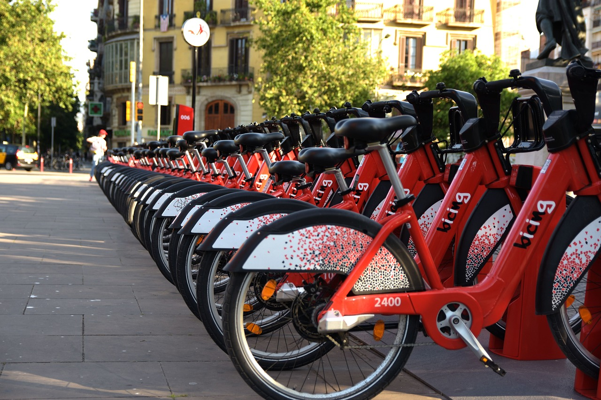
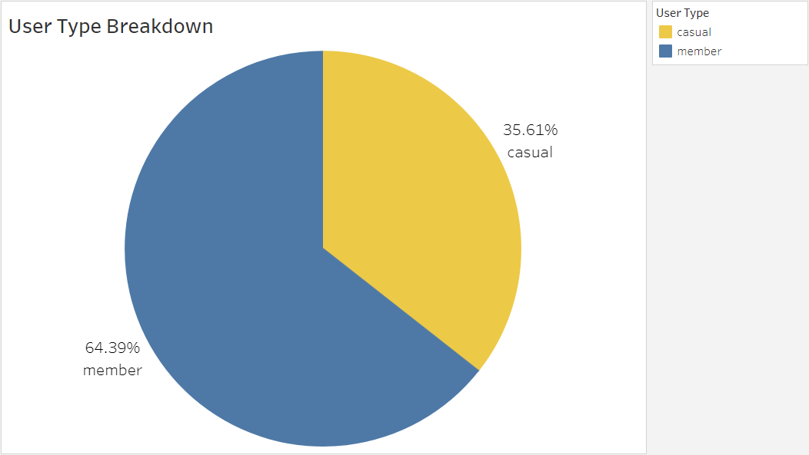
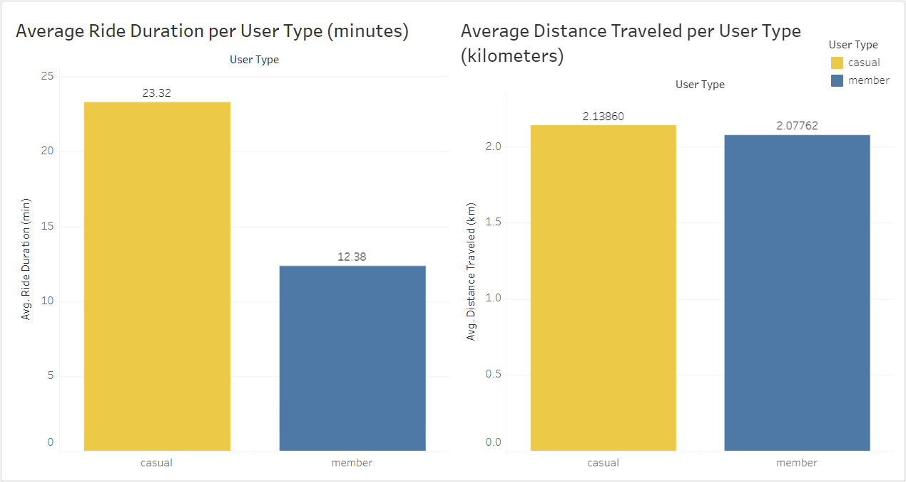
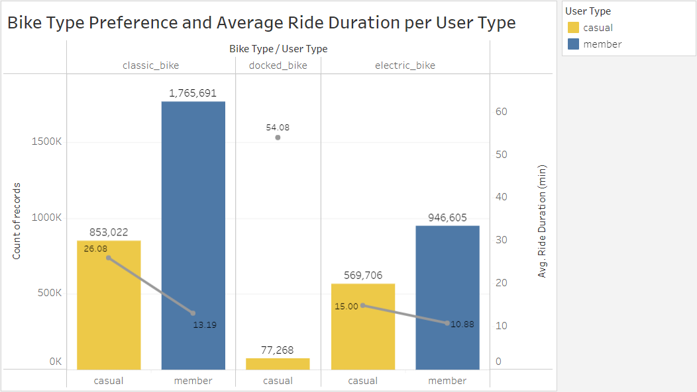
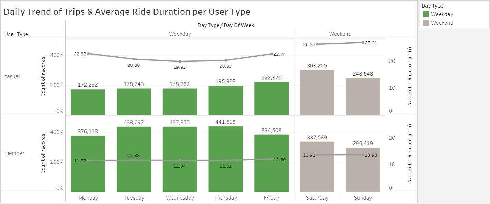
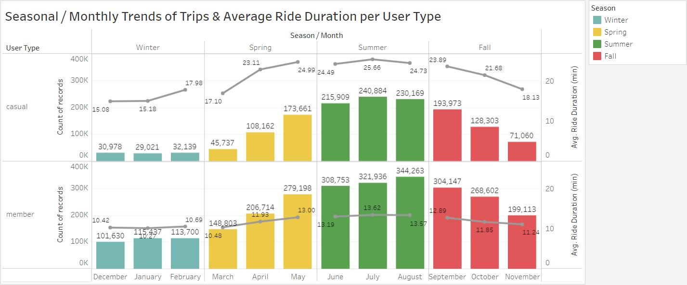
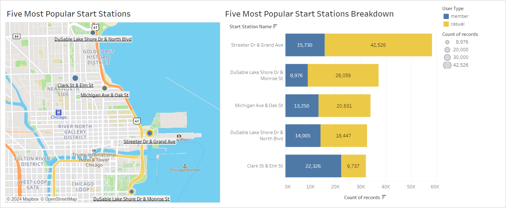
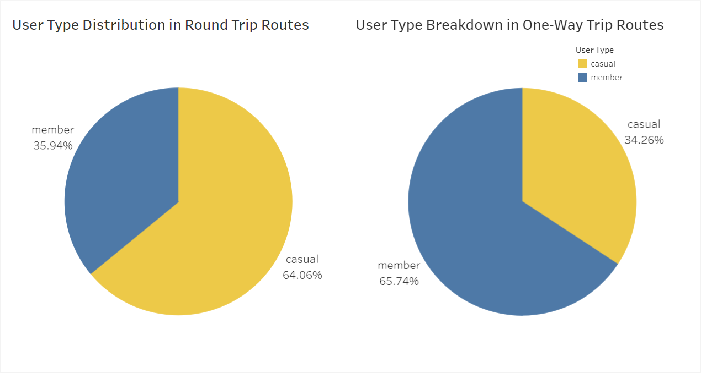

# Cyclistic Bike-Share Analysis - Google Data Analytics Capstone Project (using Python & Tableau)

This project is part of the Google Data Analytics Professional Certification Course. Its purpose is to demonstrate the application of skills acquired during the course, including formulating SMART questions, employing structured thinking, managing data, cleaning data, and conducting data analysis and visualization.

The analysis of this case study will adhere to a structured methodology, following chronological phases: ***ask, prepare, process, analyze, share and act phase.***

## Introduction
### About the Company
Cyclistic is a bike-sharing company in Chicago, which has since expanded to include a fleet of 5,824 geotracked bicycles stationed at 692 locations across Chicago. The bikes can be unlocked at one station and returned to any other station within the network at any time. Individuals buying single-ride or full-day passes fall into the category of casual riders, while those acquiring annual memberships become recognized as Cyclistic members.

### Scenario
I am a junior data analyst working in the marketing analyst team at Cyclistic. The director of marketing believes the company’s future success depends on maximizing the number of annual memberships. Therefore, my team wants to understand how casual riders and annual members use Cyclistic bikes differently. From these insights, my team will design a new marketing strategy to convert casual riders into annual members. But first, Cyclistic executives must approve your recommendations, so we must be backed up with compelling data insights and professional data visualizations.

## Phase 1: Ask
>In this phase, we will define the problem, ask SMART and effective questions and use structured thinking to communicate and manage our team and stakeholders' expectations.

### Business Task
Explore how annual members and casual riders utilize Cyclistic bikes to uncover valuable insights into their distinct preferences and patterns of usage and make data-driven strategic marketing decisions for Cyclistic.

### Stakeholders
* **Lily Moreno:** The director of marketing and your manager. Moreno is responsible for the development of campaigns and initiatives to promote the bike-share program. These may include email, social media, and other channels.
* **Cyclistic marketing analytics team:** A team of data analysts responsible for collecting, analyzing, and reporting data that helps guide Cyclistic marketing strategy. You joined this team six months ago and have been busy learning about Cyclistic’s mission and business goals and how you, as a junior data analyst, can help Cyclistic achieve them.
* **Cyclistic executive team:** The notoriously detail-oriented executive team will decide whether to approve the recommended marketing program.

## Phase 2: Prepare
>In this phase, we should grasp the process of data generation and collection, as well as recognize various data types, formats, and structures for effective utilization in data analysis. Moreover, we should ensure ethical data analysis practices and address issues of bias and credibility of the data.

### About the Dataset
The data is publicly available on an [AWS server](https://divvy-tripdata.s3.amazonaws.com/index.html). We were tasked to work with an entire year of data, so I downloaded files (CSV format) containing data from December 2022 to November 2023, one file for each month.

### Data Integrity and Credibility
The fictional company Cyclistic was created for this capstone project. The datasets are appropriate and have been made available by Motivate International Inc. under this [license](https://divvybikes.com/data-license-agreement).

A good data is ROCCC: **Reliable, Original, Comprehensive, Current, and Cited.**

**Reliable** - Despite the disclaimer of accuracy in the license agreement, the large sample size contributes to the overall reliability of the data.

**Original** - The data's originality is confirmed by its traceability to the initial data source, indicating a reliance on primary data rather than secondary or tertiary sources.

**Comprehensive** - While reviewing downloaded files, it is evident that certain fields contain no values (NULL) necessary for addressing the given business question. To enhance data comprehensiveness, I will address this issue during the data cleaning process.

**Current** - The data's relevance is maintained as it encompasses the past 12 months, ensuring its currency and alignment with current conditions.

**Cited** - Lastly, the data's credibility is bolstered by being cited, as it undergoes vetting by Motivate International Inc. and falls under its licensing agreement.

Overall, I can say that the dataset follows the **'ROCCC'** guidelines and is sufficient & valid for analysis.

### Data Structure
Each .csv file contains a table with 13 columns with varying data types as shown below. Each column stands for a field that describes how people use Cyclistic's bike-sharing service. Each row represents an observation with the details of every ride.

- ride_id = col_character(),
- rideable_type = col_character(),
- ride_id = col_character(),
- rideable_type = col_character(),
- started_at = col_datetime(format = ""),
- ended_at = col_datetime(format = ""),
- start_station_name = col_character(),
- start_station_id = col_character(),
- end_station_name = col_character(),
- end_station_id = col_character(),
- start_lat = col_double(),
- start_lng = col_double(),
- end_lat = col_double(),
- end_lng = col_double(),
- member_casual = col_character()

## Phase 3: Process 
>In this phase, we will clean and transform data while maintaining the data’s integrity. Documenting the data-cleaning process is essential to keep track of the changes made to the dataset.

I planned to use Rstudio to combine and clean the dataset. However, RStudio keeps on freezing and I can't proceed with cleaning the dataset. I switched to Python using Google Colab. You can view the Jupyter Notebook for the Process phase [here](https://github.com/ecleodominique/google_data_analytics_capstone_project/blob/main/02%2603_Prepare_and_Process.ipynb).

Here are the steps that I did during this phase
1.	Check for null and duplicates
2.	Additional columns and data transformation (change the data type, remove trailing or leading spaces, etc.)
3.	Extract data for analysis

### Data Cleaning Result
Total Row Count before data cleaning: 5,677,610

Total Row Count before data cleaning: 4,212,292

##  Phase 4: Analyze
>During this phase, we employ tools capable of formatting, transforming, filtering, and sorting our data. This enables us to recognize patterns, make predictions, draw conclusions, and provide recommendations, facilitating the formulation of data-driven decisions.

I used Python in Google Colab to look at a huge data we cleaned earlier. I came up with questions to figure out how casual riders are different from annual members. Then, I made queries to get the answers, helping us understand more and make decisions based on the data.

### Questions
Here are the following questions we will answer in this phase:
1.	What is the percentage of user types from total users?
2.	Is there a bike type preferred by different user types?
3.	Which bike type has the longest trip duration between users?
4.	What is the average trip duration per user type?
5.	What is the average distance traveled per user type?
6.	What days are most users active?
7.	What months or seasons of the year users tend to use the bike-sharing service?
8.	Which user type has the greatest number of Round trip and One-way trip routes taken?

You can view the Jupyter Notebook for the Analyze phase [here](https://github.com/ecleodominique/google_data_analytics_capstone_project/blob/main/04_Analyze.ipynb).

### Findings
* 64% of the total Cyclistic users are annual members while 36% are casual riders.
* Both annual members and casual riders prefer classic bikes. Only casual riders use docked bikes.
* Generally, casual riders have the longest average ride duration (23 minutes) compared with annual members (12 minutes).
* Both annual members and casual riders have almost the same average distance traveled.
* Docked bikes have the longest average ride duration which only casual riders use. Classic bikes have the longest average ride duration for annual members.
* Most trips are recorded on Saturday.
* There are more trips during summer and at least during winter.
* Annual members prefer one-way trips while casual riders prefer round trips.

## Phase 5: Share
>In this phase, we will use visualization to communicate and tell a data-driven story.

I used Tableau public in making the visualization. You can view the data visualization for the Share phase [here](https://public.tableau.com/views/Cyclisticbike-share_17042047075070/Story1?:language=en-US&:display_count=n&:origin=viz_share_link).

### Data Visualization
These visualizations are arranged to narrate a compelling story, providing a clear understanding of the analytical process that led to our conclusions.

***User Type Breakdown***

64% of Cyclistic users are annual members, while 36% are casual riders. This suggests that a significant portion of users are already committed annual members.

***Ride Duration and Distance Traveled***

Generally, casual riders have the longest average ride duration (23 minutes) compared to annual members (12 minutes). However, both groups have similar average distances traveled.

***Bike Preference***

Classic bikes are preferred by both annual members and casual riders. Docked bikes are exclusively used by casual riders and have the longest average ride duration.

***Daily Trip Trends***

Annual members have a higher record of trips during weekdays, indicating a likely use for daily commuting. Casual riders, on the other hand, prefer weekends for bike rides.

***Seasonal / Monthly Trip Trends***

Trips peak during summer and decrease as winter approaches possibly due to of good weather & road conditions. Casual riders consistently have a higher average ride duration in all seasons.

***Popular Stations***

Popular start stations are located near the coastlines and inside the parks throughout Chicago. Those stations are dominated by casual riders.

The popular end stations are the same as popular start stations. Same as the start stations, popular end stations are also dominated by casual riders.

***Route Types***

Round trip routes are dominated by casual riders, while one-way trip routes are dominated by annual members.

### Conclusions
*

## Phase 6: Act
>In this final phase, we utilize our insights to make decisions aimed at addressing the problems identified during the ask phase. The actions we take may involve modifying existing products/services or creating new ones.

### Recommendations
* Given the company's goal of maximizing annual memberships, design marketing campaigns that specifically target casual riders, emphasizing the benefits of annual memberships, such as cost savings and convenience.
* Since classic bikes are preferred by both groups, promote the advantages of using classic bikes for various purposes. Consider incentives or promotions for members who exclusively use classic bikes.
* Capitalize on the peak in summer usage by launching targeted marketing campaigns during this season. Highlight the pleasant weather and ideal biking conditions. Consider seasonal promotions or partnerships.
* Explore the possibility of offering more flexible membership options (such as membership during summer and weekend membership) to cater to the diverse usage patterns observed.
* Implement advertisements at popular stations, especially those near coastlines and parks. Tailor these promotions to attract both casual riders and potential annual members.
 

